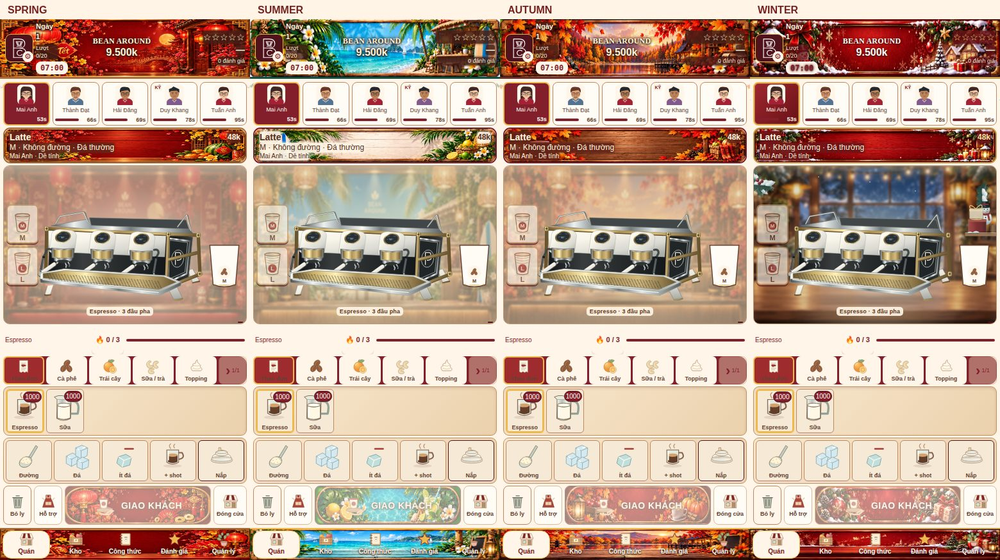
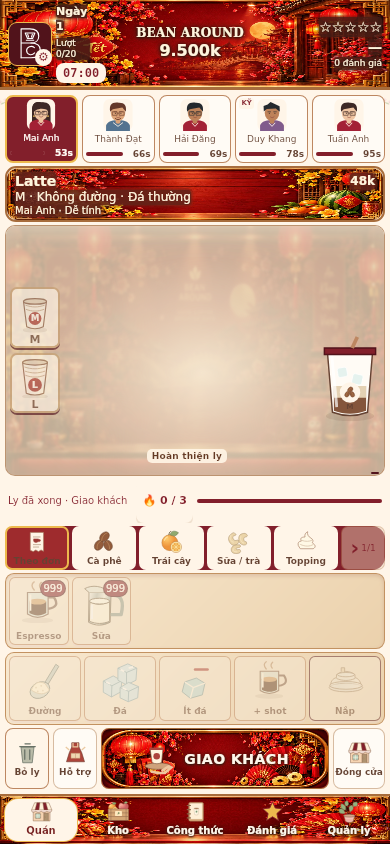

# Four-minute online service, network operations and seasonal packages

## Behavior
- Online arrivals use their own 230-second timeline, leaving ten seconds for the final work. They no longer wait for the owner's counter progress. Work budget scales to the accepted parcel quota (including promotion/season bonuses); inventory consumption, QC/remakes, bakery items, fees and dispatch use existing settlement functions. Staff/upgrades still gate the daily accepted capacity. Missing ingredients or absent online staff are not converted into free sales.
- New owner shifts last 240 active seconds; legacy saved 270-second shifts remain loadable. Reading/paused/offline time is not counted.
- Working helpers or managers maintain cleanliness at 95+ before service. Delegated/background managers additionally pay80k from their own shop wallet to restore equipment when condition falls below75 (if funded). This is paid-role cleaning, not a forced review score; actual recipe, price and waiting errors can still affect reviews.
- Stock, advertising, cleaning and maintenance actions synchronize to owned locations, each using its own wallet. Other locations buy their own demand-weighted reserve. A shop that cannot fund/perform its action reports why without partial mutation. Advertising remains once per day. Branch objects are preserved when applying a cloned root action.
- Save uses IndexedDB alongside localStorage, with monotonically increasing revision, coalesced writes, newer snapshot restoration and invalid-data protection. A quota/security failure in localStorage can recover through IndexedDB. Neither old storage nor legacy backups are deleted. Import accepts up to 64 MiB and backs up to IndexedDB when available. Both stores being unavailable remains a real browser limitation and displays an export warning.

## Seasonal art
- Tet January/February; summer May/June; autumn August/September; Christmas November/December (game calendar).
- Package artwork appears only for the owning shop while its paid term is active; calendar alone no longer grants the new skin. Explicit visual preview query parameters remain read-only.
- Existing paid Mid-autumn entitlements remain active until expiry but no new Mid-autumn package is sold. Price 30,000k, duration30days and x2 online multiplier remain unchanged.
- Tet/summer/autumn reference artwork was adapted/redrawn into separate optimized WebP banners and empty-counter rooms. It is not a pixel-identical crop of the attached artwork. Generated source atlases are retained in assets/bean-around/sources. Embedded equipment was removed from new room art to avoid duplicate machines.
- Existing SeasonTheme/shared component skin architecture retained. Internal spring theme maps to Tet. Rooms use opacity .48; live machine and cups stay sharp and opaque. Christmas art unchanged. No gameplay control geometry changed.

## Validation
Passed [GitHub Actions run 37443241612](https://github.com/tungtran2512/beanaround/actions/runs/37443241612) on Chromium and WebKit: 1,089 regression checks per engine, online quotas 300/750/1500/1700 completed within 240 active seconds (reload at halfway), three-shop managed shift, independently charged network actions, package calendar and localStorage failure -> IndexedDB -> reload.

Actual mobile browser layouts checked at 375×812, 390×844 and 430×932: unchanged gameplay geometry, touch targets/hit testing, no horizontal overflow, real recipe delivery and idle/working espresso/juicer/blender. Browser errors: none. Physical iPhone hardware was not tested.

Internal “SPRING” caption refers to the Tết package. These are actual running-game captures, not mockups.

Full machine-readable results: [Chromium](screenshots/network-packages-chromium.json), [WebKit](screenshots/network-packages-webkit.json).

## Changed files
- index.html: service pacing, network operations, persistence, package calendar and shared theme configuration/paint.
- tests/season-theme-browser.cjs: workload, storage and network validation plus visual fixtures.
- assets/bean-around/{tet,summer,autumn}-2026-ui-{header,deliver,order,footer}.webp and corresponding *-cafe-room.webp.
- assets/bean-around/sources/: three preserved generated source atlases.
- This report and actual browser screenshots/results.

## Practical limits
Orders still require real inventory, staffing and funds; shortages are reported rather than silently credited. A browser disabling both storage engines cannot persist locally and retains the export warning. New seasonal art is a faithful adaptation of supplied references, not exact source-image cropping.
