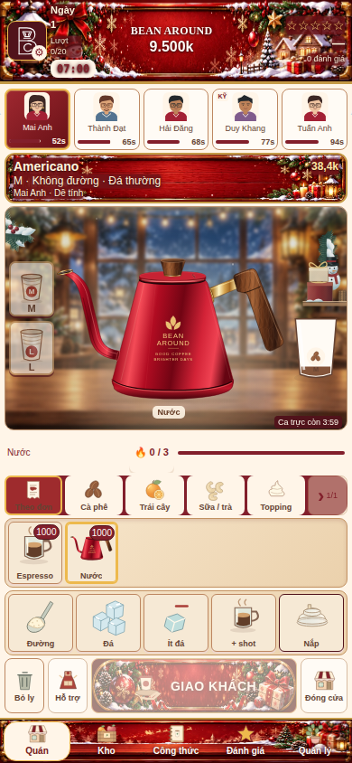

# Red kettle and stable paint
- Recreated the supplied red gooseneck kettle as a lightweight transparent SVG illustration, with crimson metal, walnut grain, gold fittings and Bean Around lettering. This is a drawn interpretation, not a photograph or an exact pixel copy.
- Replaced the shared kettle symbol so water/tea stages and existing kettle icons use the same asset. Preserved recipe IDs, sizes, timing, cup position and equipment switching rules.
- Kept order, delivery decoration, stage background and cup host nodes mounted while patching changing content. Previously panel replacement repeatedly destroyed and recreated seasonal artwork.
- Header labels update only when their displayed value changes. Removed the transient phase-label rewrite during an open shift. Added a stable header compositing layer and coalesced mobile viewport resize bursts; pinch zoom does not force game relayout.
- No gameplay/economy/save changes.

Validation passed in [run 37449680008](https://github.com/tungtran2512/beanaround/actions/runs/37449680008) on Chromium and WebKit: 1,089 regressions per engine; 375×812, 390×844, 430×932 unchanged geometry/touch and real delivery; five consecutive equipment switches preserve room/cup-host/order/CTA decoration nodes; fifty unchanged header refreshes produce zero header text mutations; management scroll up/down completed. No browser errors. Final screenshots from both engines were visually inspected.

Changed: index.html, assets/bean-around/bean-around-red-kettle.svg, tests/season-theme-browser.cjs. No source reference was overwritten.
Physical-phone compositor behavior cannot be fully verified in desktop browser automation.
