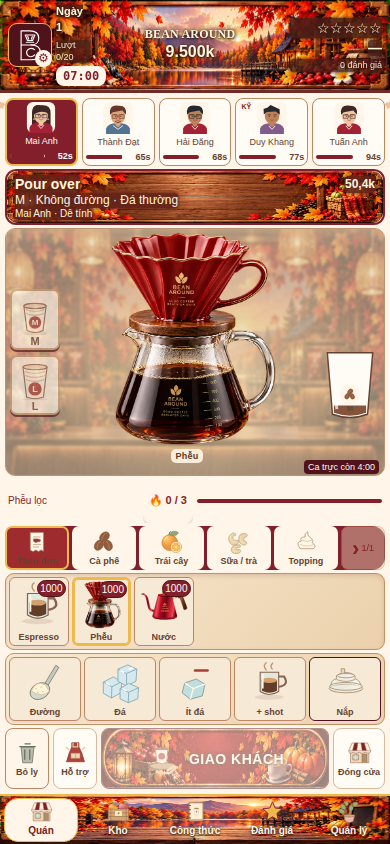

# Red pour-over and chain-wide championship
- Recreated the supplied red fluted dripper, gold rim/logo, walnut support and glass coffee server as a single transparent illustration. A generated source PNG is retained separately; the mobile WebP derivative is used by the shared pour-over symbol at the actual filter/water stage and existing icons. Existing machine/cup/controls geometry remains unchanged.
- Championship promotion (+70%, 15 inclusive game days) is read across the whole owned chain. Branch snapshots copy only promotion dates, not trophies, contest entries or history. Newly opened shops and reloaded saves inherit the current remaining term; it is never extended by opening/reloading a branch.
- Branches 2/3 get a 1.15 online demand/capacity factor. Removed the old 90% online forecast penalty; the 90% counter target remains. Comparable shops share the day's volume factor so equal conditions stay within the requested 10–20% advantage. Stock, training, advertising, attendance, prices and quality still gate actual orders.
- Championship and local paid seasonal packages multiply once each. Admission limits remain final. Already accepted queues are not retroactively rewritten.
- Updated roadmap copy and old tests whose 200/450 caps represented superseded branch behavior.

Passed [run 37451981440](https://github.com/tungtran2512/beanaround/actions/runs/37451981440) on Chromium and WebKit, with 1,089 regression checks each, no browser errors, unchanged mobile geometry/touch and real delivery at 375×812, 390×844 and 430×932. Actual pour-over stage screenshots from both engines were inspected.

Additional checks: shared promotion for existing/new branches, reload and expiry with no duplicate trophies; exactly-once stacking (575 normal / 977 championship / 1954 with local package); admission caps; equal-condition ratios 1.1489–1.15 across all seven daily factors; real stock/fees/receipts through 1,954 parcels in 240 active seconds; retained kettle/header/stage stability tests.

Files: index.html; assets/bean-around/sources/red-pour-2026.png (preserved generated source); assets/bean-around/bean-around-red-pour.webp (640px derivative, ~134KB); tests/season-theme-browser.cjs; this report and screenshot/results. Art is a reference-based recreation, not an exact original-file crop. Physical phones have not been tested.
