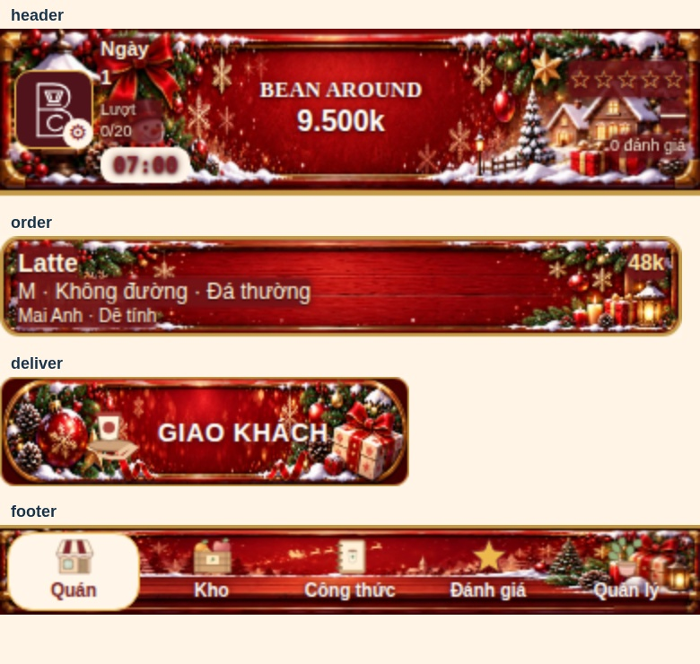
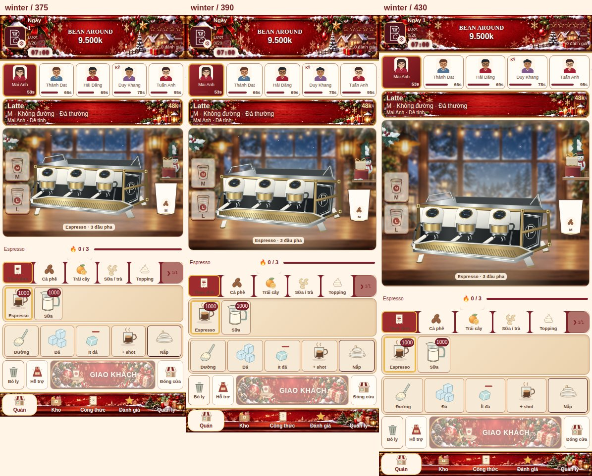
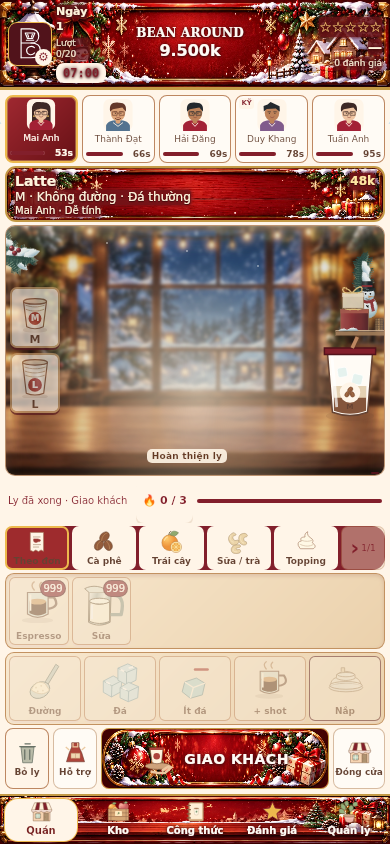

# Winter red Christmas UI

The existing winter package now renders four red/gold Christmas banner skins following the supplied reference: header (lantern, snowman and cottage), delivery button (baubles and gifts), order panel (red wood and reindeer), and navigation (winter village and sleigh).

The artwork was faithfully redrawn and packed as an atlas; it is not a pixel-identical crop of the supplied image. The untouched generated source is retained at assets/bean-around/sources/winter-red-ui-atlas-2026.png. Four separately optimized WebPs are loaded through the existing SeasonTheme.winter.uiArtwork mapping, totaling approximately 373 KiB. The full source PNG is never loaded by gameplay.

Layout, hit targets, seasonal package ownership/cost/duration/bonuses, save data, machines, other seasons and economy are unchanged. Local cream/gold text and red readability backplates replace the old navy treatment. No new runtime dependency was added.

Validation: 1,089 deterministic logic checks passed. GitHub Actions run [37416083355](https://github.com/tungtran2512/beanaround/actions/runs/37416083355) passed Chromium and WebKit at 375×812, 390×844 and 430×932. Existing section geometry, touch hit testing, real recipe completion/delivery, theme switching, stable equipment rendering, and branch online purchase paths passed, with no reported console/asset errors. Four-season regression screenshots were captured.

Visually inspected actual winter component, responsive and WebKit ready-to-deliver screenshots. No physical iPhone was tested. Production deployment is verified separately through Vercel's commit status.

